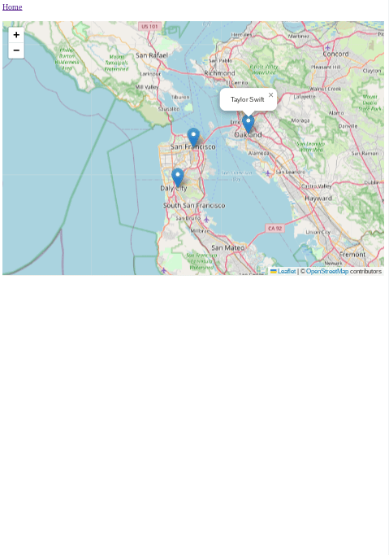
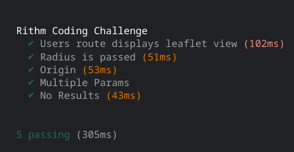

# Rithm Coding Challenge

## Requirements

Build a full stack application that does the following:

### Backend

Write an API endpoint that returns a filtered set of users from the csv provided below.

* Your API endpoint URL is /users
* Your API responds in the above format with valid GeoJSON
* Your API should correctly filter any combination of API parameters
* Your API should utilize a database
* Your API should support paginating the number of resulting users
* This should be built using Express or Flask
* Your API should be tested

## API Structure

| Parameter | Description                                    |
| --------- | ---------------------------------------------- |
| fav_color | Your favorite color                            |
| dist      | Maximum match distance in miles                |
| origin    | lat/long string of your location               |
| min_age   | Minimum age preference                         |
| max_age   | Maximum age preference                         |

Given the following request:

GET `/users?fav_color=red&dist=100&origin=37.774929,-122.419416&min_age=21&max_age=29`

The expected response should contain the following:

```json
{
  "metadata": {
    "path": "/users",
    "query": {
      "fav_color": "red",
      "dist": 100,
      "origin": "37.774929,-122.419416",
      "min_age": 21,
      "max_age": 29
    }
  },
  "num_results": 1,
  "results": [
    {
      "type": "user",
      "locationHistory": {
        "type": "FeatureCollection",
        "features": [
          {
            "type": "Feature",
            "properties": {
              "city": "Oakland"
            },
            "geometry": {
              "type": "Point",
              "coordinates": [-122.2711, 37.8044]
            }
          },
          {
            "type": "Feature",
            "properties": {
              "city": "San Francisco"
            },
            "geometry": {
              "type": "Point",
              "coordinates": [-122.419416, 37.774929]
            }
          }
        ]
      },
      "properties": {
        "id": 1,
        "name": "Taylor Swift",
        "age": 27,
        "fav_color": "red"
      }
    }
  ]
}
```

All query parameters are optional. If a query parameter is missing or the value is invalid, you should skip the related filter.

All minimum and maximum fields should be inclusive (e.g. min_age=21&max_age=23 should return users with an age of 21, 22, or 23).

### Frontend

Your application should have a frontend that displays a form and allows a user to input a favorite color, distance, origin and min and max age. When the form is submitted, a map should render with markers for the location of the users found. You can use Mapbox, Leaflet or any provider for this functionality.

## How to Use

To clone and run this application, you'll need [Git](https://git-scm.com) and [Node.js](https://nodejs.org/en/download/) (which comes with [npm](http://npmjs.com)) installed on your computer. From your command line:

```bash
# Clone this repository & the companion backend repo
$ git clone https://jdegand.github.io/rithm-coding-challenge

# Install dependencies
$ npm install

# need to import csv file into mongo database - can input data manually or use mongoimport - check data shape in leaflet.ejs
mongoimport --uri mongodb+srv://<USERNAME>:<PASSWORD>@cluster.mongodb.net/<DATABASE> --collection <NAME> --type csv/json --file <FILENAME> 

# Add MONGO_URI variable in an .env file 
$ npm start

# To test app, you need to run npm start and then in another terminal - npm run test
```

## Thoughts

- For mongodb geojson, longitude needs to be listed before latitude but leaflet needs latitude before longitude.  
- The shortening of longitude and latitude in the csv causes problems if you want to use a csv converter website.  Need to edit the file on github and give them full names before pasting the data in the converter.  
- The ages of all the celebs are wrong in the csv and not just because they are out-of-date - they were wrong initially.  
- Installing mongoimport is convoluted.  It is much quicker to manually add the data directly to atlas.
- I converted the data to geojson with a converter and then input the data one object at a time using the insert button.   
- Client.connect's use of callbacks is deprecated - need to refactor or use 'mongodb-legacy' package.
- I resisted using mongoose here - it makes it easier to connect to mongo but no other real use in this application.
- Documentation on using express without mongoose is surprisingly sparse and mostly out-of-date.
- Need to look into having a variable zoom level on a leaflet map.  
- (0,0) location is all blue ocean and you can be fooled thinking the map didn't load in correctly.  It would better to have a more zoomed out view for that case.  
- $gt / $lt is not inclusive - need $gte / $lte
- meters to miles - divide by 1609
- miles to meters - multiply by 1609
- Had many failures on getting the right formula to test this app
- A Mocha and Chai implementation similar to the [RedditJS](https://github.com/jdegand/redditjs) tests did not translate to this app.  
- Mocha and Chai (in particular) seems to be an outdated way of testing.  
- Mixing promises and callbacks seems to cause problems with chai.    
- Had to search on github to find something that would work when testing the application 
- Tests are similar to [this](https://github.com/bflaven/node-countries-mysql-crud-ejs)
- Instead of using cheerio, could have used a jquery plugin
- I am sure there are better ways to do this but I don't want to devote a ton of time to this 
- If I used react, I would have used cypress

## Screenshots 






## Useful Resources

- [Convert CSV](https://www.convertcsv.com/csv-to-geojson.htm)
- [Mongo](https://www.mongodb.com/blog/post/quick-start-nodejs-mongodb-how-to-get-connected-to-your-database)
- [Mongo](https://www.mongodb.com/developer/products/mongodb/mongoimport-guide/)
- [Mongo](https://www.mongodb.com/docs/atlas/import/mongoimport/)
- [YouTube](https://www.youtube.com/watch?v=Z5oeSHPyqzs) - import csv into mongo using node
- [YouTube](https://www.youtube.com/watch?v=fkGafwD-b1s) - export json into mongo atlas
- [Stack Overflow](https://stackoverflow.com/questions/49092856/importing-your-data-into-mongodb-atlas)
- [Isotropic](https://isotropic.co/how-to-implement-pagination-in-mongodb/)
- [Stack Overflow](https://stackoverflow.com/questions/59058240/ignore-a-parameter-in-a-query-if-it-arrives-null-in-mongodb)
- [YouTube](https://www.youtube.com/watch?v=lHmQXaXv2nA)
- [Stack Overflow](https://stackoverflow.com/questions/36374842/how-can-i-connect-to-mongodb-using-express-without-mongoose)
- [Stack Overflow](https://stackoverflow.com/questions/71899948/express-and-mongodb-without-mongoose)
- [Rithm School](https://www.rithmschool.com/courses/intermediate-node-express/api-tests-with-jest)
- [Stack Overflow](https://stackoverflow.com/questions/60020381/mongodb-atlas-bad-auth-authentication-failed-code-8000)
- [Github](https://github.com/fChristenson/sans-mongoose)
- [Dev.to](https://dev.to/kamalhossain/mongodb-without-mongoose-1k69)
- [Github](https://github.com/kamal-hossain/blog-4-mongodb-without-mongoose)
- [Github](https://github.com/mongodb-developer/nodejs-quickstart)
- [Mongo](https://www.mongodb.com/developer/languages/javascript/node-crud-tutorial/?_ga=2.140780722.1489775898.1669073769-214589954.1669073769)
- [DZone](https://dzone.com/articles/crud-operations-on-mongodb-thru-nodejs)
- [Stack Overflow](https://stackoverflow.com/questions/70581891/get-mongodb-collection-by-name-in-node-js)
- [Mongo](https://www.mongodb.com/languages/express-mongodb-rest-api-tutorial)
- [Github](https://github.com/mongodb-developer/mern-stack-example)
- [Stack Overflow](https://stackoverflow.com/questions/19579791/optional-parameters-for-mongodb-query)
- [Leaflet](https://leafletjs.com/examples/quick-start/)
- [LaraCasts](https://laracasts.com/discuss/channels/code-review/leaflet-js-map-not-showing-fully-on-page-load)
- [Stack Overflow](https://stackoverflow.com/questions/11289793/accessing-ejs-variable-in-javascript-logic)
- [YouTube](https://www.youtube.com/watch?v=Ookp481CCjI)
- [Stack Overflow](https://stackoverflow.com/questions/19579791/optional-parameters-for-mongodb-query)
- [Stack Overflow](https://stackoverflow.com/questions/43167417/calculate-distance-between-two-points-in-leaflet)
- [Stack Overflow](https://stackoverflow.com/questions/42968243/how-to-add-multiple-markers-in-leaflet-js)
- [Stack Overflow](https://stackoverflow.com/questions/46539106/accessing-passed-ejs-variable-in-javascript-file)
- [Stack Overflow](https://stackoverflow.com/questions/7273668/how-to-split-a-long-array-into-smaller-arrays-with-javascript)
- [Stack Overflow](https://stackoverflow.com/questions/49491452/map-an-array-by-every-two-elements)
- [Stack Overflow](https://stackoverflow.com/questions/22952044/loop-through-json-in-ejs)
- [Stack Overflow](https://stackoverflow.com/questions/46821081/leaflet-throwing-uncaught-typeerror-cannot-read-property-lat-of-undefined-w)
- [Leaflet](https://leafletjs.com/reference.html) - instead of using setView()
- [Stack Overflow](https://stackoverflow.com/questions/27186167/set-view-for-an-array-of-addressesno-coordinates-using-leaflet-js)
- [DelftStack](https://www.delftstack.com/howto/mongodb/mongodb-find-multiple-conditions/#:~:text=Find%20Multiple%20Conditions%20Using%20the%20%24or%20Operator%20The,%28%29%2C%20update%20%28%29%2C%20etc.%2C%20as%20per%20the%20requirements.)
- [Raddy.dev](https://raddy.dev/blog/query-mongodb-with-custom-url-parameters/)
- [Stack Overflow](https://stackoverflow.com/questions/50836242/how-does-thenconsole-log-and-then-console-log-in-a-promise-chain)
- [Stack Overflow](https://stackoverflow.com/questions/17303320/drawing-circle-with-radius-specified-in-meters-on-a-map)
- [GitLab](https://gitlab.com/pragmaticreviews/node-mocha-chai)
- [Stack Overflow](https://stackoverflow.com/questions/16607039/in-mocha-testing-while-calling-asynchronous-function-how-to-avoid-the-timeout-er)
- [Semaphore](https://semaphoreci.com/community/tutorials/getting-started-with-node-js-and-mocha)
- [Stack Overflow](https://stackoverflow.com/questions/59129597/mocha-async-test-is-timing-out)
- [YouTube](https://www.youtube.com/watch?v=qd-Z6t_AL4w)
- [Stack Overflow](https://stackoverflow.com/questions/42371649/test-rendering-views-with-ejs-in-mocha)
- [Github](https://github.com/ravichandranjv/UnitTestingNodeJSRoute)
- [Github](https://github.com/bflaven/node-countries-mysql-crud-ejs) - used same method to test application
- [Stack Overflow](https://stackoverflow.com/questions/28652080/how-to-result-the-contents-of-a-javascript-variable-using-cheerio-jquery-like-s)